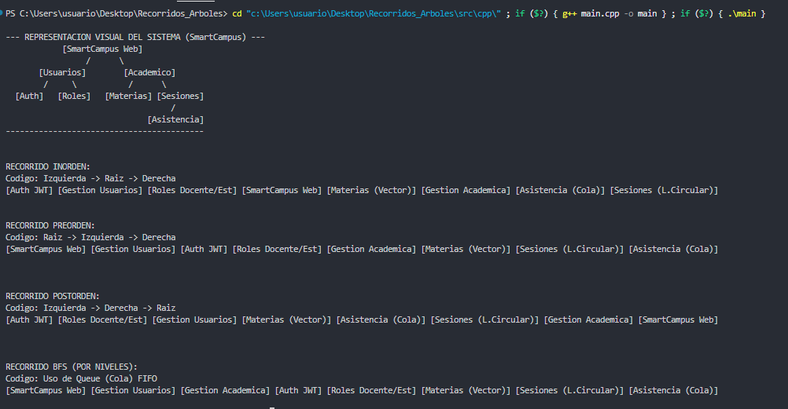
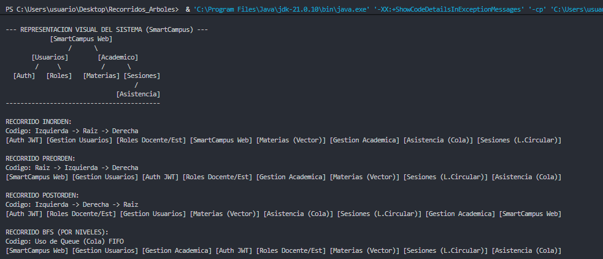

# Recorridos de Árboles Binarios - Estructura de Datos

**Universidad Técnica de Ambato**  
**Carrera:** Ingeniería de Software  
**Asignatura:** Estructura de Datos  
**Curso:** Tercero B  
**Tema:** Recorridos de árboles binarios: Inorden, Preorden, Postorden y BFS

## Objetivo general
Implementar y analizar los principales recorridos de árboles binarios utilizando C++ y Java, aplicando estructuras de datos dinámicas, recursividad y colas.

## Actividad  sugerida:

1. Clonar el repositorio.
2. Ejecutar el código base.
3. Agregar mínimo 5 nodos nuevos.
4. Mostrar los cuatro recorridos.
5. Modificar el caso de aplicación al proyecto final.
6. Subir evidencias al repositorio GitHub del grupo.


##  Entregables

### Código C++

```cpp
#include <iostream>
#include <string>
#include <queue>

using namespace std;

// Representa un módulo del proyecto final SmartCampus
class Nodo {
public:
    string modulo;
    Nodo *izq, *der;
    Nodo(string m) : modulo(m), izq(nullptr), der(nullptr) {}
}; 

class DibujanteArbol {
public:
    void imprimirEstructura() {
        cout << "\n--- REPRESENTACION VISUAL DEL SISTEMA (SmartCampus) ---" << endl;
        cout << "            [SmartCampus Web]              " << endl;
        cout << "                 /      \\                 " << endl;
        cout << "       [Usuarios]        [Academico]       " << endl;
        cout << "        /     \\           /      \\        " << endl;
        cout << "  [Auth]   [Roles]   [Materias] [Sesiones] " << endl;
        cout << "                                   /       " << endl;
        cout << "                              [Asistencia] " << endl;
        cout << "------------------------------------------" << endl;
    }
};

class GestionSistema {
public:
    Nodo* raiz;

    GestionSistema() {
        raiz = new Nodo("SmartCampus Web");
        raiz->izq = new Nodo("Gestion Usuarios");
        raiz->izq->izq = new Nodo("Auth JWT");
        raiz->izq->der = new Nodo("Roles Docente/Est");
        
        raiz->der = new Nodo("Gestion Academica");
        raiz->der->izq = new Nodo("Materias (Vector)");
        raiz->der->der = new Nodo("Sesiones (L.Circular)");
        raiz->der->der->izq = new Nodo("Asistencia (Cola)");
    } 

    void recorridoInorden(Nodo* r) {
        if (r == nullptr) return;
        recorridoInorden(r->izq);
        cout << "[" << r->modulo << "] ";
        recorridoInorden(r->der);
    }

    void recorridoPreorden(Nodo* r) {
        if (r == nullptr) return;
        cout << "[" << r->modulo << "] ";
        recorridoPreorden(r->izq);
        recorridoPreorden(r->der);
    }
 
    void recorridoPostorden(Nodo* r) {
        if (r == nullptr) return;
        recorridoPostorden(r->izq);
        recorridoPostorden(r->der);
        cout << "[" << r->modulo << "] ";
    } 

    void recorridoBFS() {
        if (raiz == nullptr) return;
        queue<Nodo*> cola;
        cola.push(raiz);
        while (!cola.empty()) {
            Nodo* actual = cola.front();
            cola.pop();
            cout << "[" << actual->modulo << "] ";
            if (actual->izq) cola.push(actual->izq);
            if (actual->der) cola.push(actual->der);
        }
    }
}; 

int main() {
    GestionSistema smart;
    DibujanteArbol dibujo;

    dibujo.imprimirEstructura();

    cout << "\n\nRECORRIDO INORDEN:";
    cout << "\nCodigo: Izquierda -> Raiz -> Derecha\n";
    smart.recorridoInorden(smart.raiz); 
    cout << "\n\n";

    cout << "\nRECORRIDO PREORDEN:";
    cout << "\nCodigo: Raiz -> Izquierda -> Derecha\n";
    smart.recorridoPreorden(smart.raiz);
    cout << "\n\n";

    cout << "\n\nRECORRIDO POSTORDEN:";
    cout << "\nCodigo: Izquierda -> Derecha -> Raiz\n";
    smart.recorridoPostorden(smart.raiz);
    cout << "\n\n";

    cout << "\n\nRECORRIDO BFS (POR NIVELES):";
    cout << "\nCodigo: Uso de Queue (Cola) FIFO\n";
    smart.recorridoBFS();

    cout << "\n\n";
    return 0;
}
```

### Código Java

```java
import java.util.LinkedList;
import java.util.Queue;

class Nodo {
    String modulo;
    Nodo izq, der;

    public Nodo(String m) {
        this.modulo = m;
        this.izq = null;
        this.der = null;
    }
}

class DibujanteArbol {
    public void imprimirEstructura() {
        System.out.println("\n--- REPRESENTACION VISUAL DEL SISTEMA (SmartCampus) ---");
        System.out.println("            [SmartCampus Web]              ");
        System.out.println("                 /      \\                 ");
        System.out.println("       [Usuarios]        [Academico]       ");
        System.out.println("        /     \\           /      \\        ");
        System.out.println("  [Auth]   [Roles]   [Materias] [Sesiones] ");
        System.out.println("                                   /       ");
        System.out.println("                              [Asistencia] ");
        System.out.println("------------------------------------------");
    }
}

class GestionSistema {
    public Nodo raiz;

    public GestionSistema() {
        raiz = new Nodo("SmartCampus Web");
        raiz.izq = new Nodo("Gestion Usuarios");
        raiz.izq.izq = new Nodo("Auth JWT");
        raiz.izq.der = new Nodo("Roles Docente/Est");
        
        raiz.der = new Nodo("Gestion Academica");
        raiz.der.izq = new Nodo("Materias (Vector)");
        raiz.der.der = new Nodo("Sesiones (L.Circular)");
        raiz.der.der.izq = new Nodo("Asistencia (Cola)");
    }

    public void recorridoInorden(Nodo r) {
        if (r == null) return;
        recorridoInorden(r.izq);
        System.out.print("[" + r.modulo + "] ");
        recorridoInorden(r.der);
    }

    public void recorridoPreorden(Nodo r) {
        if (r == null) return;
        System.out.print("[" + r.modulo + "] ");
        recorridoPreorden(r.izq);
        recorridoPreorden(r.der);
    }

    public void recorridoPostorden(Nodo r) {
        if (r == null) return;
        recorridoPostorden(r.izq);
        recorridoPostorden(r.der);
        System.out.print("[" + r.modulo + "] ");
    }

    public void recorridoBFS() {
        if (raiz == null) return;
        Queue<Nodo> cola = new LinkedList<>();
        cola.add(raiz);
        while (!cola.isEmpty()) {
            Nodo actual = cola.poll();
            System.out.print("[" + actual.modulo + "] ");
            if (actual.izq != null) cola.add(actual.izq);
            if (actual.der != null) cola.add(actual.der);
        }
    }
}

public class Main {
    public static void main(String[] args) {
        GestionSistema smart = new GestionSistema();
        DibujanteArbol dibujo = new DibujanteArbol();

        dibujo.imprimirEstructura();

        System.out.println("\nRECORRIDO INORDEN:");
        System.out.println("Codigo: Izquierda -> Raiz -> Derecha");
        smart.recorridoInorden(smart.raiz);
        System.out.println("\n");

        System.out.println("RECORRIDO PREORDEN:");
        System.out.println("Codigo: Raiz -> Izquierda -> Derecha");
        smart.recorridoPreorden(smart.raiz);
        System.out.println("\n");

        System.out.println("RECORRIDO POSTORDEN:");
        System.out.println("Codigo: Izquierda -> Derecha -> Raiz");
        smart.recorridoPostorden(smart.raiz);
        System.out.println("\n");

        System.out.println("RECORRIDO BFS (POR NIVELES):");
        System.out.println("Codigo: Uso de Queue (Cola) FIFO");
        smart.recorridoBFS();

        System.out.println("\n");
    }
}
```

--- 


## Arquitectura SmartCampus

```
            [SmartCampus Web]              
                 /      \                 
       [Usuarios]        [Academico]       
        /     \           /      \        
  [Auth]   [Roles]   [Materias] [Sesiones] 
                                   /       
                              [Asistencia] 
```

---

## 📸 Evidencias de Ejecución

**Captura C++:**


**Captura Java:**
    

---

## 🔍 Aplicación al Caso Real: Arquitectura SmartCampus

### 3.1 Dinámica del Árbol y Jerarquía

El árbol actúa como el esqueleto organizativo del sistema SmartCampus. La **raíz** (SmartCampus Web) funciona como orquestador principal. La ramificación separa responsabilidades administrativas de académicas, garantizando modularidad y escalabilidad.

### 3.2 Los 5 Nodos Nuevos Implementados

**1. Auth JWT (Nodo Nuevo 1):**
- Ubicación: Hijo izquierdo de Gestión Usuarios
- Función: Primer filtro de seguridad con autenticación basada en tokens JWT
- Características: Se visita tempranamente en Preorden (coherente con flujo real)
- Implicación: La autenticación debe ocurrir antes de acceder a otras subfunciones

**2. Roles Docente/Estudiante (Nodo Nuevo 2):**
- Ubicación: Hijo derecho de Gestión Usuarios
- Función: Define alcance y permisos del usuario
- Características: Coexiste con Auth JWT como proceso hermano
- Implicación: El recorrido BFS los identifica en el mismo nivel (procesos paralelos)

**3. Materias (Vector) (Nodo Nuevo 3):**
- Ubicación: Hijo izquierdo de Gestión Académica
- Función: Base del área académica
- Características: Definido como Vector para demostrar composición de estructuras
- Implicación: Un nodo del árbol puede contener otras estructuras de datos

**4. Sesiones (L. Circular) (Nodo Nuevo 4):**
- Ubicación: Hijo derecho de Gestión Académica
- Función: Gestión de tiempo y eventos en el campus
- Características: Representada como Lista Circular para navegación cíclica
- Implicación: Ubicación estratégica permite búsqueda rápida de sesiones activas

**5. Asistencia (Cola) (Nodo Nuevo 5):**
- Ubicación: Hijo izquierdo de Sesiones (Nivel 3)
- Función: Registro y procesamiento de asistencia
- Características: Implementada como Cola (FIFO)
- Implicación: Máxima profundidad refleja que asistencia alimenta reportes superiores

### 3.3 Comportamiento de los Recorridos

**Enfoque BFS (Amplitud):** El algoritmo de búsqueda por niveles permite al sistema SmartCampus reconocer primero las grandes áreas (Usuarios y Académico) antes de intentar cargar los detalles técnicos (JWT o Vectores). Esto simula un proceso de carga progresiva (Lazy Loading).

**Enfoque DFS (Profundidad):** Los recorridos recursivos permiten navegar por la cadena de mando del software. Por ejemplo, el recorrido hacia el nodo de Asistencia demuestra cómo el sistema debe descender desde el núcleo web, pasando por la gestión académica y sesiones, hasta llegar al dato final.


## Rúbrica breve sobre 10 puntos

| Criterio | Puntaje |
|---|---:|
| Implementación correcta de recorridos | 3 |
| Uso correcto de recursividad y cola | 2 |
| Código comentado y organizado | 1.5 |
| Aplicación al proyecto final | 2 |
| Uso de GitHub e IA documentada | 1.5 |

